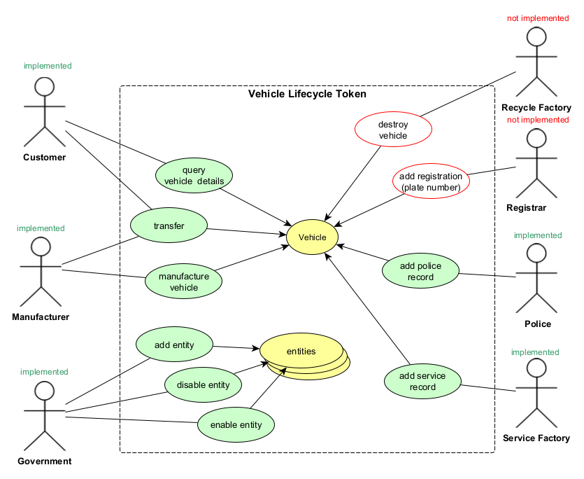

# Vehicle Lifecycle Token

This is final project for **Consensys academy blockchain developer bootcamp 2021**.

> Please note that this is a fork of [scaffold-eth](https://github.com/scaffold-eth/scaffold-eth) thus you would see a lot of contributors and commits (please check commit history to see what is going on).

Inspiration for this project taken from paper: [A Blockchain-Based Vehicle Condition Recording System for Second-Hand Vehicle Market](https://www.hindawi.com/journals/wcmc/2021/6623251/)

## The Idea

In modern world ownership of something could be proofed in digital way.
Vehicle lifecycle tokenization is one of approaches to introduce transparency to the process.
It provides multiple benefits for all parties that are participating in lifecycle:

- **Manufacturers** - can produce (mint) vehicle tokens and preserve all information in immutable form on-chain with additional information off-chain (also in immutable and distributed way with IPFS)
- **Service Factories** - can add service log entries to the vehicles
- **Police Departments** - can add incident log entries to the vehicles
- **Customers** - can see all information regarding vehicle ownership history, service history, and incident history to make informed decision on buying or selling vehicles. Tokenization allow owner to send vehicle token to Auction and get highest price in digital currency. Alternatively customer can pay fiat money to manufacturer or dealer directly and get token ownership transferred immediately.
- **Government** - can control all participants on the market, registering manufacturers, service factories, and police departments to the smart contract so they could perform specialized actions to the vehicles. If licensing required for particular role it could be also integrated to the smart contract so participant license could be validated on method execution.

## Use-cases



## Smart contract class diagram


## Deployed contract

You can check deployed contract on Ropsten testnet:
[0xbe5a19a8a400b9c8bde1f534ea92ace4e58231d2](https://ropsten.etherscan.io/address/0xbe5a19a8a400b9c8bde1f534ea92ace4e58231d2)

## Folder structure

Here is a list of important folders and their description.

| Folder                       | Description                                 |
|:-----------------------------|:--------------------------------------------|
| `data`                       | Example Data for entities & entity metadata |
| `docs`                       | Documentation files                         |
| `packages/hardhat/contracts` | Smart contracts                             |
| `packages/react-app`         | FrontEnd                                    |
| `scripts`                    | Scripts to run things locally               |

## Architecture

- [Solution Architecture](docs/architecture.md)

## Smart contracts

- [Smart Contracts](docs/smart-contracts.md)

## User interface

- [User interface](docs/user-interface.md)

## Distribution

IPFS is used everywhere to store information off-chain. For all entities metadataUri stored on-chain, and file itself is stored on IPFS thus all associated information is protected from forgery as well.

Because data is spread between on-chain and off-chain there should be some logic implemented in UI client that would assemble all pieces and present as full picture to the user. But it is not a mandatory requirement the system could operate with on-chain only data, but in this case user experience would be below expectations.

## How to run dev env

All commands should be executed from the root of repository.

> in a first terminal window, start your local blockchain:

```bash
yarn install
yarn chain
```

> in a second terminal window, deploy your contract:

```bash
yarn deploy
```

> in a third terminal window, start your frontend:

```bash
yarn start
```

Open http://localhost:3000 to see the app

## 3rd Party resources

- Image database (The car connection) [picture-scraper](https://github.com/nicolas-gervais/predicting-car-price-from-scraped-data/tree/master/picture-scraper)

## Technologies

## Services

- [pinata.cloud](http://pinata.cloud) - IPFS gateway
- [alchemy](alchemy.com) - Etherium network http gateway
