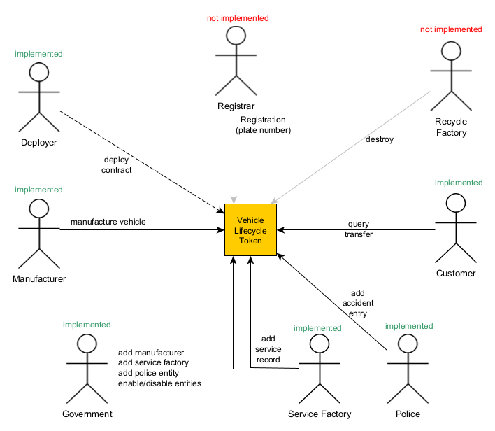

# Vehicle Lifecycle Token

This is final project for Consensys academy blockchain developer bootcamp.

Please note that this is a fork of [scaffold-eth](https://github.com/scaffold-eth/scaffold-eth).

## The idea

In modern world ownership of something could be proofed in digital way.
Vehicle lifecycle tokenization is one of approaches to introduce transparency to the process.
It provides multiple benefits for all parties that are participating in lifecycle:

- Manufacturers - can produce (mint) vehicle tokens and preserve all information in immutable form on-chain with additional information off-chain (also in immutable and distributed way with IPFS)
- Service Factories - can add service log entries to the vehicles
- Police Departments - can add incident log entries to the vehicles
- Customers - can see all information regarding vehicle ownership history, service history, and incident history to make informed decision on buying or selling vehicles. Tokenization allow owner to send vehicle token to Auction and get highest price in digital currency. Alternatively customer can pay fiat money to manufacturer or dealer directly and get token ownership transferred immediately.
- Government - can control all participants on the market, registering manufacturers, service factories, and police departments to the smart contract so they could perform specialized actions to the vehicles. If licensing required for particular role it could be also integrated to the smart contract so participant license could be validated on method execution.



Inspiration taken from paper: [A Blockchain-Based Vehicle Condition Recording System for Second-Hand Vehicle Market](https://www.hindawi.com/journals/wcmc/2021/6623251/)

## Implementation details

Current implementation of smart contract have 4 distinct roles:

- Government
- Manufacturer
- Service Factory
- Police Department

Every role has its own set of methods that are allowed to be executed.

## Smart contract structure

Contract is divided by several parts, each part is responsible for its own area.
Common logic for 3 entities (Manufacturers, ServiceFactories, PoliceDepartments) is extracted to `EntityManagement.sol` class to keep contract size under control. Also there are `*Capability.sol` and `*Management.sol` parts that are responsible for main role features and role management respectively.

Please note that there is no `GovernmentCapability.sol` - Government is only register participants and enable/disable their access, but it does not touch vehicles itself.

|Filename                        | Description                            |
|:-------------------------------|:---------------------------------------|
| VehicleLifecycleToken.sol      | Main contract / entry point            |
| EntityManagement.sol           | Common entity management logic         |
| GovernmentManagement.sol       | Add, Enable/Disable participants       |
| LifecycleAccessControl.sol     | Roles definition + service functions   |
| ManufacturerCapability.sol     | ManufactureVehicle + service functions |
| PoliceDepartmentCapability.sol | AddPoliceLogEntry + service functions  |
| ServiceFactoryCapability.sol   | AddServiceLogEntry + service functions |
| ManufacturerManagement.sol     | entity management                      |
| PoliceDepartmentManagement.sol | entity management                      |
| ServiceFactoryManagement.sol   | entity management                      |

To optimize contract size in future all capabilities could be converted to separate contracts, so main contract would delegate calls to capability contracts.

## Conventions

All public methods are protected by security modifiers related to role or ownership.
Ownership is separated from role model.

Owner could be deployer and it can assign first `admin` (Government) that can in turn create other participants.

## Distribution

IPFS is use everywhere to store information off-chain. For all entities metadataUri stored on-chain, and file itself is stored on IPFS thus all associated information is protected from forgery as well.

### Government methods

- a
- b

### Manufacturer methods

- a
- b

### Service Factory methods

- a
- b

### Police Department methods

- a
- b

## How to run dev env

All commands should be executed from the root of repository.

> in a first terminal window, start your local blockchain:

```bash
yarn install
yarn chain
```

> in a second terminal window, deploy your contract:

```bash
yarn deploy
```

> in a third terminal window, start your frontend:

```bash
yarn start
```

Open http://localhost:3000 to see the app

## 3rd Party resources

- Image database (The car connection) [picture-scraper](https://github.com/nicolas-gervais/predicting-car-price-from-scraped-data/tree/master/picture-scraper)

## Technologies

## Services

- [pinata.cloud](http://pinata.cloud) - IPFS gateway
- [alchemy](alchemy.com) - Etherium network http gateway