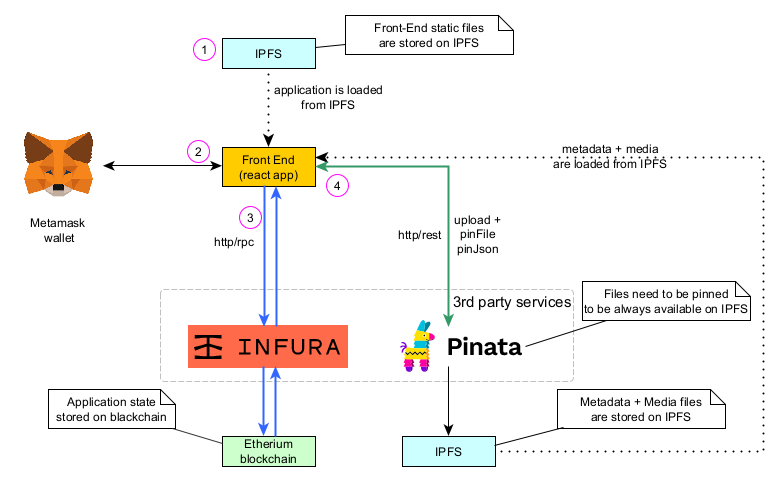

# Vehicle Lifecycle Token

This is final project for **Consensys academy blockchain developer bootcamp 2021**.

> Please note that this is a fork of [scaffold-eth](https://github.com/scaffold-eth/scaffold-eth) thus you would see a lot of contributors and commits (please check commit history to see what is going on).

Inspiration for this project taken from paper: [A Blockchain-Based Vehicle Condition Recording System for Second-Hand Vehicle Market](https://www.hindawi.com/journals/wcmc/2021/6623251/)

## The Idea

In modern world ownership of something could be proofed in digital way.
Vehicle lifecycle tokenization is one of approaches to introduce transparency to the process.
It provides multiple benefits for all parties that are participating in lifecycle:

- **Manufacturers** - can produce (mint) vehicle tokens and preserve all information in immutable form on-chain with additional information off-chain (also in immutable and distributed way with IPFS)
- **Service Factories** - can add service log entries to the vehicles
- **Police Departments** - can add incident log entries to the vehicles
- **Customers** - can see all information regarding vehicle ownership history, service history, and incident history to make informed decision on buying or selling vehicles. Tokenization allow owner to send vehicle token to Auction and get highest price in digital currency. Alternatively customer can pay fiat money to manufacturer or dealer directly and get token ownership transferred immediately.
- **Government** - can control all participants on the market, registering manufacturers, service factories, and police departments to the smart contract so they could perform specialized actions to the vehicles. If licensing required for particular role it could be also integrated to the smart contract so participant license could be validated on method execution.

## Use-cases


## Architecure



More details could be found in [Architecture](docs/architecture.md) section.

## User interface


User interface details could be found in [User interface](docs/user-interface.md) section.

## User interface walkthrough

[](https://www.youtube.com/watch?v=7fIWNWd17cs)

Youtube [link](https://www.youtube.com/watch?v=7fIWNWd17cs)

## Deployed contract

You can check deployed contract on Ropsten testnet:
[0xbe5a19a8a400b9c8bde1f534ea92ace4e58231d2](https://ropsten.etherscan.io/address/0xbe5a19a8a400b9c8bde1f534ea92ace4e58231d2)

All details about Smart contracts could be found in [Smart Contracts](docs/smart-contracts.md) section.

## Folder structure

Here is a list of important folders and their description.

| Folder                       | Description                                 |
|:-----------------------------|:--------------------------------------------|
| `data`                       | Example Data for entities & entity metadata |
| `docs`                       | Documentation files                         |
| `packages/hardhat/contracts` | Smart contracts                             |
| `packages/react-app`         | FrontEnd                                    |
| `scripts`                    | Scripts to run things locally               |

## How to run dev env

All commands should be executed from the root of repository.

> in a first terminal window, start your local blockchain:

```bash
yarn install
yarn chain
```

Please check deployment script and change addresses to yours: `packages/hardhat/deploy/00_deploy_your_contract.js` (all addresses are different in this setup).

```js
{
...
  // Manufacturers
  await vehicleLifecycleToken.add(
    1,
    "0xDE740E368128Ece3e604dC9db747679A469f0Dd3", 
    "Porsche",
    "ipfs://QmRPjEtKnH56T3Khdq4YP6sWWEzHAfWXbnpS4Y9Qz6embE");
  await vehicleLifecycleToken.add(
    1,
    "0xb67EDD32D46ceD740b0F45ccD8408fa87FFA9C05", 
    "Kia",
    "ipfs://QmWYVZj53Gyepykg8FQN6i5WHuv1dq8NWKnSefTFkVn77U");

  // Service factories
  await vehicleLifecycleToken.add(
    2,
    "0x3B81e758Bd8163f5db425e7Fba402E18FCc8958D", 
    "Plaza Kia",
    "ipfs://QmUzD5MAFYU2LDKSQN5kiTH5xcM2aGLiK4TdS1rFYPcyKv");
  await vehicleLifecycleToken.add(
    2,
    "0x44d5Fb46BcA0bB486836789c40838bd5404834AB",
    "Manhattan Motorcars",
    "ipfs://QmWrdYxiA4LkiEuMFdhPy3pUBDHaqQJkFKe152XhVNHrsT");

  // Police Departments
  await vehicleLifecycleToken.add(
    3,
    "0x332b3E20452bD9d89Cf89473111BeA0c052E651a", 
    "New York City Police Department", 
    "ipfs://QmUyKBosqz2dzynvCP1qxa4rZrFgf1Z5dCbC7ozJpPrKUE");
  await vehicleLifecycleToken.add(
    3,
    "0x7b25648f9C5aDF7A887Ac451A69F137cde90916E", 
    "Metropolitan Police Department of the District of Columbia", 
    "ipfs://QmYy3UjFmCWbgPHvQT2Sxq8BDRynddGFhPc9wtvsHs7vJk");
    
  // Admin role and ownership
  await vehicleLifecycleToken.setAdminRole("0x06199F0B1312DDAD50daCD024a52323c3ff91312");
  await vehicleLifecycleToken.transferOwnership("0x06199F0B1312DDAD50daCD024a52323c3ff91312");
...
}
```

> in a second terminal window, deploy your contract:

```bash
yarn deploy
```

You need to configure pinata api keys, otherwise media/metadata upload to IPFS would not work.
Update file `packages/react-app/.env`:

```yaml
REACT_APP_PINATA_API_KEY=<pinata-api-key>
REACT_APP_PINATA_API_SECRET=<pinata-api-secret>
```

> in a third terminal window, start your frontend:

```bash
yarn start
```

Open [http://localhost:3000](http://localhost:3000) to see the app

## Metamask default localhost network would not work

If you select default metamask localhost network you will see the following exception in UI:


Please make sure you have created new network in metamask as default `localhost 8545` would not work as hardhat network have different chainId and it would not be able to interact with hatdhat local chain.


## Prepare for testnet/mainnet

### Configure contract deployment

Generate deployer account.

```bash
yarn generate
```

It will create file in `packages\hardhat` with mnemonic.

Change destination in `packages\hardhat\hardhat.config.js` (example for `ropsten` testnet):

```javascript
const defaultNetwork = "ropsten";
```

Update credentials for deployment in `packages\hardhat\.env` (example for `ropsten` testnet):

```yaml
# Ropsten
ROPSTEN_INFURA_KEY=<infura-secret-key>
ROPSTEN_DEPLOYER_PRIV_KEY=<deployer-private-key>
```

Deploy to target network

```bash
yarn deploy
```

You might need to tweak gas in `packages\hardhat\hardhat.config.js` for your network :

```js
  networks: {
...
    ropsten: {
      url: "https://ropsten.infura.io/v3/<infura-project-id>", 
      gasPrice: 10*1000000000, // default gas price might be too low
      accounts: {
        mnemonic: mnemonic(),
      },
    },
...
  }
```

### Configure front-end app

Example yaml for `ropsten` testnet. You need to create accounts on **infura** and **pinata** and generate api keys.

Update file `packages/react-app/.env`:

```yaml
REACT_APP_PROVIDER=https://ropsten.infura.io/v3/<your-infura-project-id>
REACT_APP_NETWORK=ropsten
REACT_APP_PINATA_API_KEY=<pinata-api-key>
REACT_APP_PINATA_API_SECRET=<pinata-api-secret>
```

## Deploy front-end to IPFS

The main idea is to have fully distributed application setup, thus it worth to deploy front-end to IPFS

Build production version of react-application

```bash
yarn build
```

And deploy it to IPFS

```bash
yarn ipfs
```

In the end you would see destination address in console output, like the following:

```bash
🛰  Sending to IPFS...
📡 App deployed to IPFS with hash: QmcKXUATLnKyozrN61jbcT195ipf9aUQFTcuPmWN8SWhPG

🚀 Deployment to IPFS complete!

Use the link below to access your app:
   IPFS: https://ipfs.io/ipfs/QmcKXUATLnKyozrN61jbcT195ipf9aUQFTcuPmWN8SWhPG

```

It is good idea to pin this url in pinata to make sure it would not disappear randomly.

## 3rd party resources

- Image database (The car connection) [picture-scraper](https://github.com/nicolas-gervais/predicting-car-price-from-scraped-data/tree/master/picture-scraper)

## 3rd party services

- [pinata.cloud](http://pinata.cloud) - IPFS gateway
- [infura](http://infura.io) - Ethereum network http gateway
