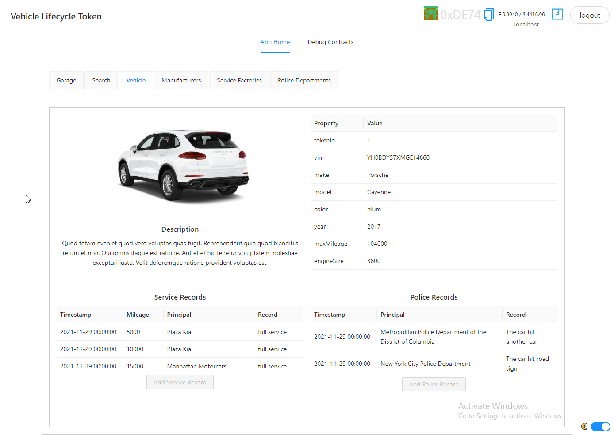

# Vehicle Lifecycle Token

This is final project for **Consensys academy blockchain developer bootcamp 2021**.

> Please note that this is a fork of [scaffold-eth](https://github.com/scaffold-eth/scaffold-eth) thus you would see a lot of contributors and commits (please check commit history to see what is going on).

Inspiration for this project taken from paper: [A Blockchain-Based Vehicle Condition Recording System for Second-Hand Vehicle Market](https://www.hindawi.com/journals/wcmc/2021/6623251/)

## The Idea

In modern world ownership of something could be proofed in digital way.
Vehicle lifecycle tokenization is one of approaches to introduce transparency to the process.
It provides multiple benefits for all parties that are participating in lifecycle:

- **Manufacturers** - can produce (mint) vehicle tokens and preserve all information in immutable form on-chain with additional information off-chain (also in immutable and distributed way with IPFS)
- **Service Factories** - can add service log entries to the vehicles
- **Police Departments** - can add incident log entries to the vehicles
- **Customers** - can see all information regarding vehicle ownership history, service history, and incident history to make informed decision on buying or selling vehicles. Tokenization allow owner to send vehicle token to Auction and get highest price in digital currency. Alternatively customer can pay fiat money to manufacturer or dealer directly and get token ownership transferred immediately.
- **Government** - can control all participants on the market, registering manufacturers, service factories, and police departments to the smart contract so they could perform specialized actions to the vehicles. If licensing required for particular role it could be also integrated to the smart contract so participant license could be validated on method execution.

## Use-cases


## Architecure


More details could be found in [Architecture](docs/architecture.md) section.

## User interface



User interface details could be found in [User interface](docs/user-interface.md) section.

## User interface walkthrough

[](https://www.youtube.com/watch?v=7fIWNWd17cs)

Youtube [link](https://www.youtube.com/watch?v=7fIWNWd17cs)

## Deployed contract

You can check deployed contract on Ropsten testnet:
[0xbe5a19a8a400b9c8bde1f534ea92ace4e58231d2](https://ropsten.etherscan.io/address/0xbe5a19a8a400b9c8bde1f534ea92ace4e58231d2)

All details about Smart contracts could be found in [Smart Contracts](docs/smart-contracts.md) section.

## Deployed application

Please make sure you have selected `Ropsten` testnet before navigating. 
Check browser console if you see nothing (if you don't select proper network you will see errors):

```js
Uncaught (in promise) ReferenceError: NETWORK is not defined
    at Je (main.4df264c4.chunk.js:1)
...
    at t.unstable_runWithPriority (2.1ce127e2.chunk.js:2)
```

Application is deployed to IPFS, so first time load could take some time.

- [https://bafybeifmu7uey7hkqyc4iaxcntiyem57lbglgstbzmdkd6uwq5xnwjj3um.ipfs.dweb.link](https://bafybeifmu7uey7hkqyc4iaxcntiyem57lbglgstbzmdkd6uwq5xnwjj3um.ipfs.dweb.link/) - **primary link**
- [http://vlt.zhozhin.com/](http://vlt.zhozhin.com/) - S3 fallback (in case IPFS would not work by some reason)

Please use Brave or Chrome browser, it does not work in Firefox/Safari.

## Folder structure

Here is a list of important folders and their description.

| Folder                       | Description                                            |
|:-----------------------------|:-------------------------------------------------------|
| `data`                       | Example Data for entities & entity metadata            |
| `docs`                       | Documentation files                                    |
| `packages/hardhat/contracts` | Smart contracts                                        |
| `packages/react-app`         | FrontEnd                                               |
| `scripts`                    | Scripts to run things locally                          |
| [avoiding_common_attacks.md](avoiding_common_attacks.md)   | Avoiding common attacks  |
| [design_pattern_decisions.md](design_pattern_decisions.md) | Design pattern decisions |

## Local dev env setup

Please check instructions here: [Local environment setup](docs/local-env-setup.md)

## Testnet/mainnet deployment

Please check instructions here: [Testnet deployment](docs/testnet-deployment.md)

## Misc

### 3rd party resources

- Image database (The car connection) [picture-scraper](https://github.com/nicolas-gervais/predicting-car-price-from-scraped-data/tree/master/picture-scraper)

### 3rd party services

- [pinata.cloud](http://pinata.cloud) - IPFS gateway
- [infura](http://infura.io) - Ethereum testnet network http gateway
- [alchemy](http://alchemy.com) - Ethereum mainnet http gateway \[Optional\]
