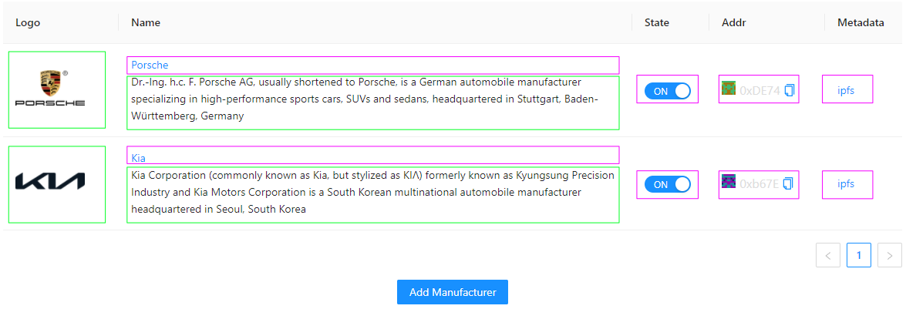

# Solution Architecture

The application leverages blockchain (all sensible data about vehicles and participants) and IPFS (metadata + images).

Ethereum blockchain allow distributed and controlled environment to store important information without worrying that data could be amended/faked. Critical data about vehicle is stored on-chain:

- vin - vehicle identification number (assigned by manufacturer)
- make - manufacturer name
- model - vehicle model (assigned by manufacturer)
- color - color (assigned by manufacturer)
- year - year of vehicle issue (assigned by manufacturer)
- maxMileage - max mileage (assigned by manufacturer)
- engineSize - engine size in cubic centimeters (assigned by manufacturer)
- tokenUri - IPFS link to metadata json with `ERC721Metadata` schema (assigned by manufacturer)

Due to expense of the blockchain storage it was decided to move everything else off-chain and store in immutable way on IPFS to avoid data loss and eliminate possibility of forgery. So smart contract is enforcing that all references to external storage should be **IPFS links**.

## Main components


1. Application files are loaded from IPFS
2. Metamask is used to authenticate and authorize user. Wallet address is used to fetch user roles from blockchain using `getRoles(addr)` method
3. Communication with blockchain is implemented via HTTP gateway. It could be any gateway that supports blockchain RPC
4. User can upload images for managed entities (Manufacturers/Service Factories/Police Departments), for vehicle (vehicle image), and associated metadata for everything (managed entities, vehicle, police and service log entries)

> All 3rd party services could be replaced with local instances of blockchain full/light client (for blockchain interaction) and ipfs local app (for media/metadata upload and pinning), so there will be no dependencies on 3rd party services and application would have no single point of failure. For this project it is the simplest option to leverage these services to have application without any backend.

## Implementation details

Current implementation of smart contract have 4 distinct roles:

- Government
- Manufacturer
- Service Factory
- Police Department

If someone does not have explicit role defined it has implicit **readonly role** with ability to **transfer** owned vehicles.

Every role has its own set of methods that are allowed to be executed, please check [Smart Contracts](smart-contracts.md).

## Smart contract class diagram


## Immutable metadata

Every entity in the project have some attributed stored on chain and off-chain metadata stored on IPFS.
All *managed entities* (Manufacturers, Service Factories, and Police Departments) have standard set of attributes from `Entity` struct:

```javascript
struct Entity {
    address addr;       // participant address
    string name;        // participant name
    State state;        // participant state
    string metadataUri; // everything else is off-chain in metadata JSON
}
```

### Manufacturers

Example metadata for manufacturer (stored on IPFS).
Please note that `image` attribute is pointing also to IPFS - this is desirable but not enforced.

```json
{
  "name": "Porsche",
  "image": "https://ipfs.io/ipfs/QmPAYiSEeggcPBAwUqrNWvPHYpJKKwVxFGJhUSGKJVFWTA",
  "description": "Dr.-Ing. h.c. F. Porsche AG, usually shortened to Porsche, is a German automobile manufacturer specializing in high-performance sports cars, SUVs and sedans, headquartered in Stuttgart, Baden-Württemberg, Germany",
  "external_uri": "https://www.kia.com/us/en",
  "attributes": [
  ]
}
```

Joined data view (on-chain/purple and off-chain/green):



### Service Factories

Example metadata for service factory (stored on IPFS). An `image` attribute is desirable to point to IPFS resource.

```json
{
  "name": "Manhattan Motorcars",
  "image": "https://ipfs.io/ipfs/Qme7gGfHBy2A1TV7vXiwRJqS9VPxCYxEt2uMctPNctDz4w",
  "description": "Manhattan Motorcars is a certified Porsche dealer serving drivers throughout New York and the surrounding areas",
  "external_uri": "https://www.manhattanmotorcarsporsche.com/",
  "attributes": [
    {
      "attr_type": "address_line",
      "value": "711 Eleventh Ave, New York"
    },
    {
      "attr_type": "postal_code",
      "value": "NY 10019"
    },
    {
      "attr_type": "country",
      "value": "United States"
    }   
  ]
}
```

Please note that it has extra `attributes`.

Joined data view (on-chain/purple and off-chain/green):


### Service log entry

On-chain data:

```javascript
struct ServiceFactoryLogEntry {
    uint256 timestamp; // timestamp of entry
    address principal; // address who made this entry
    uint32 mileage;    // we would store mileage every time vehicle is services
    string recordUri;  // to store everything else off-chain
}
```

Off-chain metadata (stored on IPFS):

```json
{
  "vin": "YH0BDY57XMGE14660",
  "vehicle": "Porsche Cayenne",
  "color": "plum",
  "year": 2017,
  "mileage": "15000",
  "datetime": "2021-11-29 00:00:00",
  "summary": "full service",
  "details": "Checked lights, tyres, exhaust and operations of brakes and steering"
}
```

Joined data view (on-chain/purple and off-chain/green):


### Police Departments

Example metadata for police department (stored on IPFS).

```json
{
  "name": "New York City Police Department",
  "image": "https://ipfs.io/ipfs/QmXoypizjW3WknFiJnKLwHCnL72vedxjQkDDP1mXWo6uco/I/m/Patch_of_the_New_York_City_Police_Department.svg.png",
  "description": "The New York City Police Department (NYPD or NYCPD), officially the City of New York Police Department, is the largest municipal police force in the United States.",
  "external_uri": "https://www1.nyc.gov/site/nypd/index.page",
  "attributes": [
    {
      "attr_type": "address_line",
      "value": "1 Police Plaza Path, New York"
    },
    {
      "attr_type": "postal_code",
      "value": "NY 10038"
    },
    {
      "attr_type": "country",
      "value": "United States"
    }   
  ]
}
```

Joined data view (on-chain/purple and off-chain/green):


### Police log entry

On-chain data:

```javascript
struct PoliceDepartmentLogEntry {
    uint256 timestamp; // timestamp of entry
    address principal; // address who make this entry
    string recordUri;  // to store everything else off-chain
}
```

Off-chain data (stored on IPFS):

```json
{
  "vin": "YH0BDY57XMGE14660",
  "vehicle": "Porsche Cayenne",
  "color": "plum",
  "year": 2017,
  "datetime": "2021-11-29 00:00:00",
  "summary": "The car hit road sign",
  "details": "Incident Details would go here"
}

```

Joined data view (on-chain/purple and off-chain/green):


### Vehicle

Example metadata for vehicle (stored on IPFS).

```json
{
  "name": "Porsche Cayenne",
  "image": "https://ipfs.io/ipfs/QmUjYW1s68bSBoAnG348HToFRx3vEP8sM3KMVnE6Vd7Dho",
  "description": "Quod totam eveniet quod vero voluptas quas fugit. Reprehenderit quia quod blanditiis rerum et non. Qui omnis itaque est ratione. Aut et et hic tenetur voluptatem molestiae excepturi iusto. Velit doloremque ratione provident voluptas est.",
  "external_uri": "",
  "attributes": [
    { "attr_type": "make", "value": "Porsche" },
    { "attr_type": "model", "value": "Cayenne" },
    { "attr_type": "color", "value": "plum" },
    { "attr_type": "year", "value": "2017" },
    { "attr_type": "max_mileage", "value": 104000 },
    { "attr_type": "engine_size", "value": 3600 }
  ]
}
```

Joined data view (on-chain/purple and off-chain/green):


