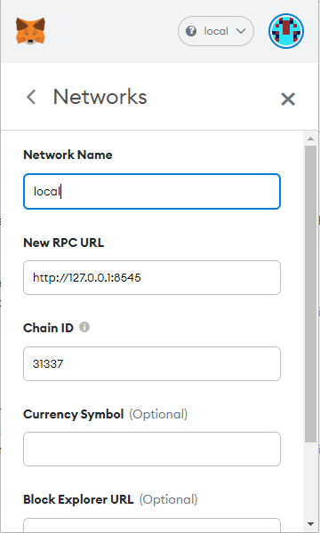

# Local env setup

## Pre-requisites

- Node 16.x
- Yarn 1.22
- Infura account with API key
- Pinata account with API key (`pinFileToIPS` and `pinJSONToIPFS` access required)
- [Brave browser](https://brave.com/) (or [Google Chrome](https://www.google.com/chrome/index.html))

## How to run dev env

All commands should be executed from the root of repository.

### Install dependencies

```bash
yarn install
```

### Configure deployment addresses/entities

Please check deployment script and change addresses to yours: `packages/hardhat/deploy/00_deploy_your_contract.js` (all addresses are different in default setup, but you can use same address for all roles, but then remove second entries as duplicates are not allowed).
It is necessary as not all UI forms are ready, so it would be not possible to recreate everything from UI, only via API or during deployment time (most convenient).

```js
{
...
  // Manufacturers
  await vehicleLifecycleToken.add(
    1,
    "<1st manufacturer address>", 
    "Porsche",
    "ipfs://QmRPjEtKnH56T3Khdq4YP6sWWEzHAfWXbnpS4Y9Qz6embE");

  // Service factories
  await vehicleLifecycleToken.add(
    2,
    "<1st service factory address>", 
    "Plaza Kia",
    "ipfs://QmUzD5MAFYU2LDKSQN5kiTH5xcM2aGLiK4TdS1rFYPcyKv");

  // Police Departments
  await vehicleLifecycleToken.add(
    3,
    "<1st police department>", 
    "New York City Police Department", 
    "ipfs://QmUyKBosqz2dzynvCP1qxa4rZrFgf1Z5dCbC7ozJpPrKUE");
    
  // Admin/Government role
  await vehicleLifecycleToken.setAdminRole("<admin/government address>");

...
}
```

### Start your local blockchain & deploy smart contracts

> in a first terminal, start local blockchain:

```bash
yarn chain
```

> in a second terminal window, deploy your contract:

```bash
yarn deploy
```

### Configure and start frontend

You need to configure pinata api keys (`pinFileToIPS` and `pinJSONToIPFS` access required), otherwise media/metadata upload to IPFS would not work.


Create/update file `packages/react-app/.env`:

```yaml
REACT_APP_PINATA_API_KEY=<pinata-api-key>
REACT_APP_PINATA_API_SECRET=<pinata-api-secret>
```

> in a third terminal window, start your frontend:

```bash
yarn start
```

Open [http://localhost:3000](http://localhost:3000) to see the app

## Metamask default localhost network would not work

If you select select wrong network for local environment you will see the following exception in UI:


Please make sure you have created new network/updated existing one in metamask as default settings for `localhost 8545` have different chainId and it would not be able to interact with hatdhat local chain.

