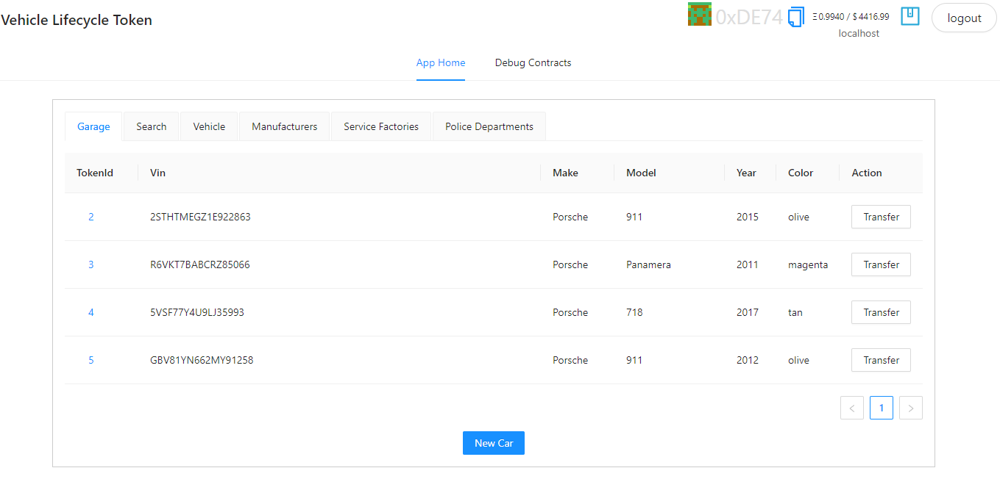
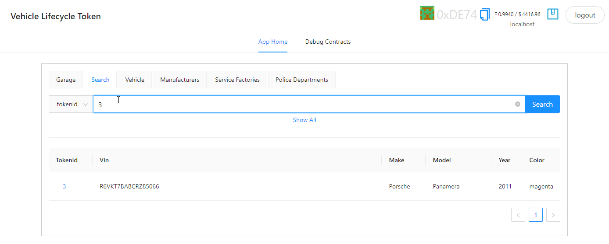
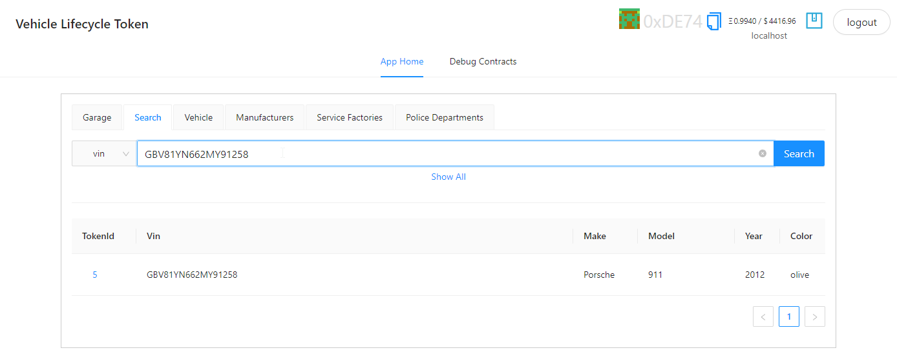
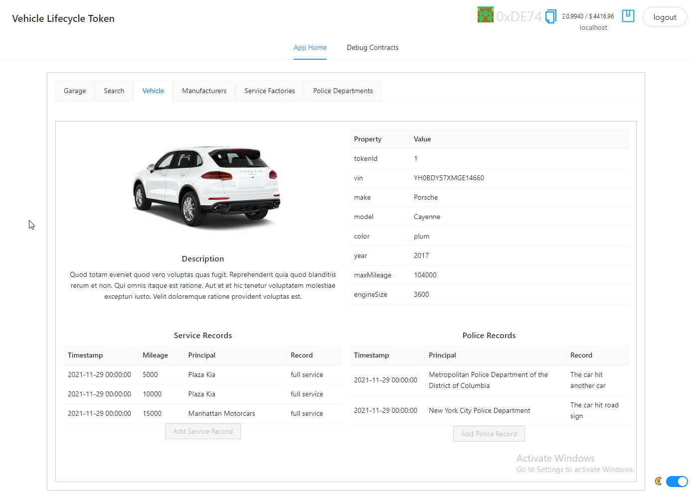
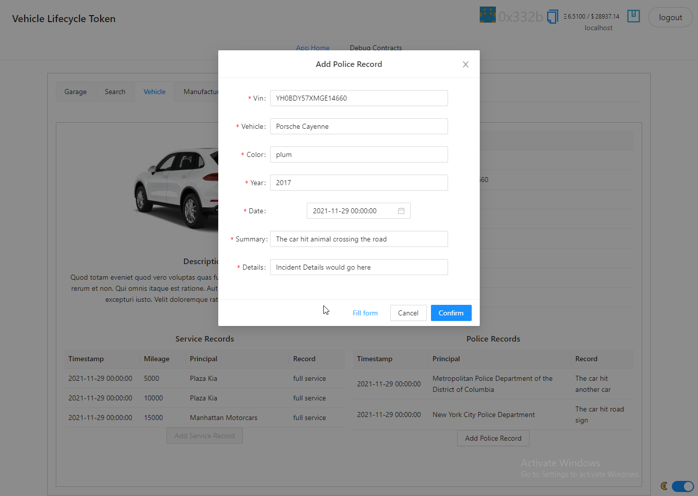
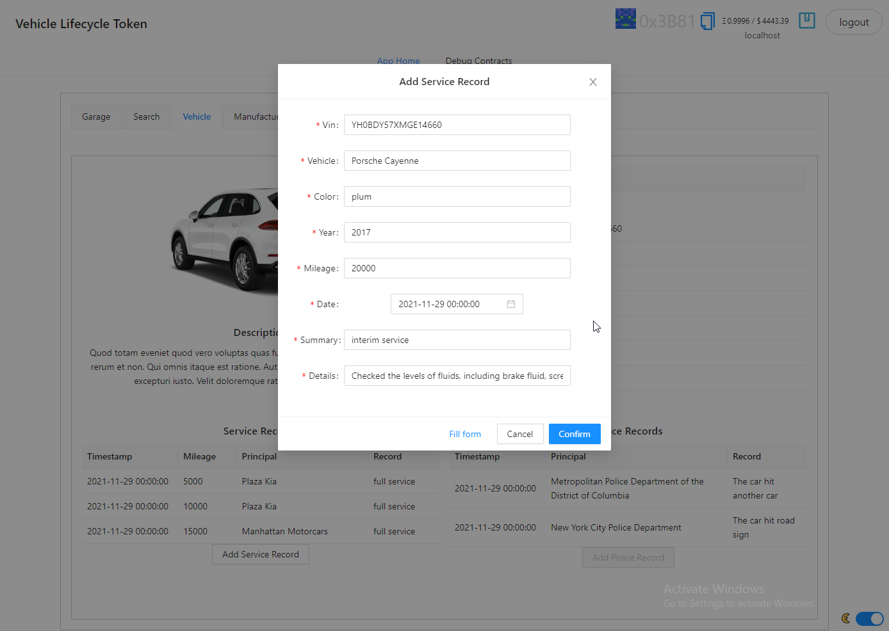
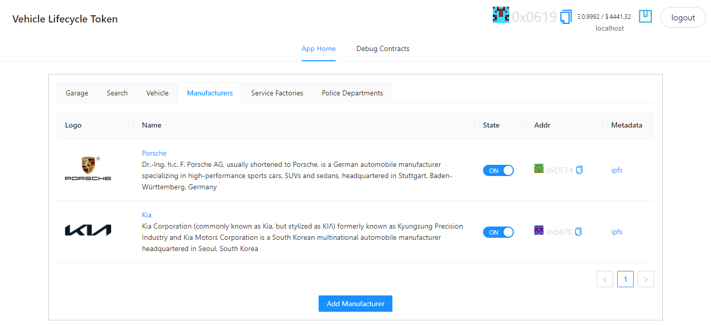
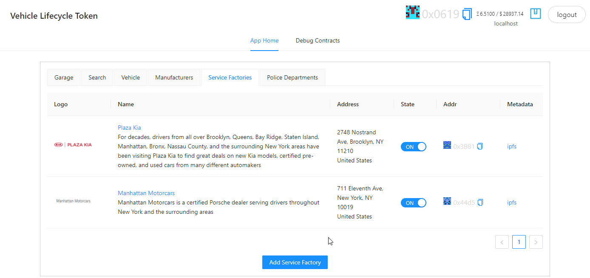
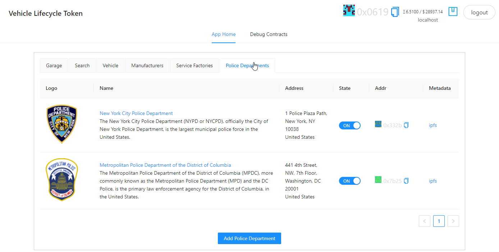
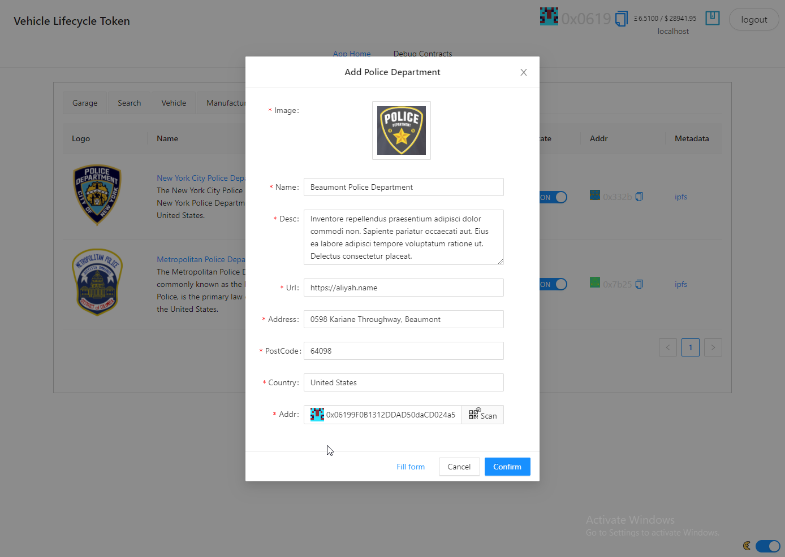

# User interface

User interface is divided into several tabs to display different aspects of application.

## Garage

Garage view display full list of vehicles belong to current user (authenticated by address via metamask).

## Search

Search allow to search for vehicles based on `tokenId` and `vin`.

## Vehicle

Vehicle details view show all information regarding vehicle (on-chain + off-chain data) plus associated log entries from Service Factories and Police Departments.

If participant have appropriate access rights he can add service/police entries

### Police log entry

### Service Factory log entry

## Manufacturers

## Service Factories

## Police Departments

